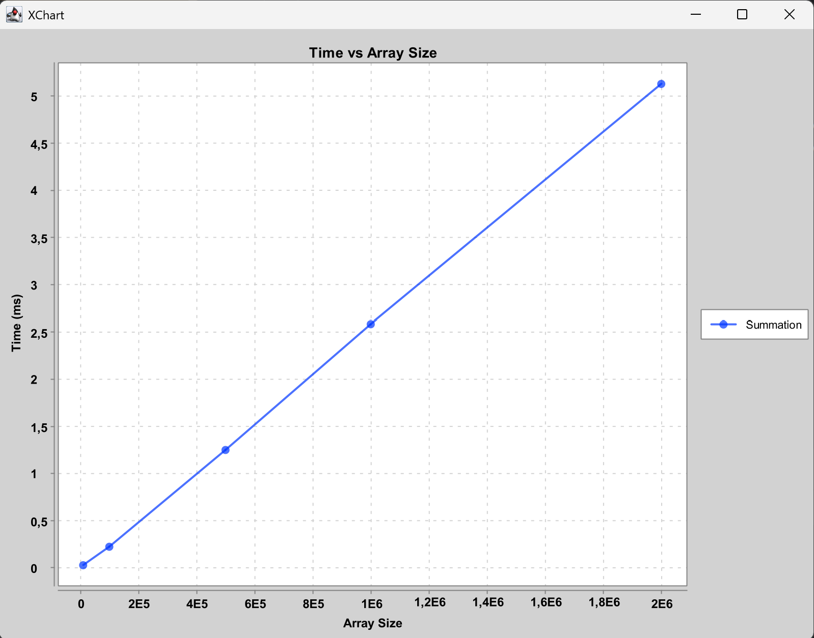

# Отчет по лабораторной работе 00 
# Решение алгоритмических задач. Введение в инструменты и критерии оценки. 

**Дата:** 2025-10-09  
**Семестр:** 3 курс 1 полугодие - 5 семестр  
**Группа:** Пиж-б-о-23-2   
**Дисциплина:** Анализ сложности алгоритмов  
**Студент:** Шевченко Денис Александрович  

## Цель работы
Настроить рабочее окружение, освоить базовые операции ввода/вывода, написать и протестировать первую программу. Научиться оценивать сложность отдельных операций и всей программы, проводить эмпирические замеры времени выполнения и визуализировать результаты. 

## Теоретическая часть
* Алгоритм — это последовательность шагов для решения определенной задачи. 
* Структуры данных — способы организации данных для эффективной работы с ними. 
* Оценка решения: Правильность работы алгоритма и его эффективность (скорость работы и потребление памяти) — ключевые критерии качества. 
* Ввод и вывод данных: Стандартные потоки ввода/вывода (stdin, stdout). Работа с консолью. 
* Сложность алгоритма: Количество операций, выполняемых алгоритмом, как функция от объема входных данных (N). Описывается с помощью О-нотации (O-большое). 

## Практическая часть

### Выполненные задачи
* Написать программу, которая проверяет линейную зависимость времени выполнения операции попарного сложения элементов массива от их количества.

### Ключевые фрагменты кода
Вычисление среднего времени обработки массива
```kotlin
for (i in 1..1000) {
    val time = measureTimeMillis {
        // Основная операция суммирования по массиву — O(n)
        for (index in 1..size - 1) {
            sum += list[index - 1] + list[index] // доступ по индексу — O(1)
            }
        }
    if (i > 10) {
        timeSum += time // O(1)
        }
    }
``` 


## Результаты выполнения

### Пример работы программы
```bash
Summation 5000 takes 0.024 milliseconds
Summation 50000 takes 0.212 milliseconds
Summation 250000 takes 1.053 milliseconds
Summation 500000 takes 2.049 milliseconds
Summation 1000000 takes 4.093 milliseconds
```

## Выводы
1. Для чистоты замеров обязательно проводить прогрев кэша перед замером времени обработки цикла
2. Время суммирования n элементов дейстивтельно имеет сложность O(n)

## Приложения
 

### Характеристики ПК
* Объем ОЗУ: 24 Гб
* Скорость ОЗУ: 6400 МТ/с
* Количество ядер процессора: 8
* Потоков процессора: 16
* Частоты процессора: базовая- 3800 MHz, TurboBoost- 5100 MHz
* Внутренняя память процессора: L1- 8x32+8x32КБ, L2- 8x1024КБ, L3- 16384КБ
* ОС: Win11