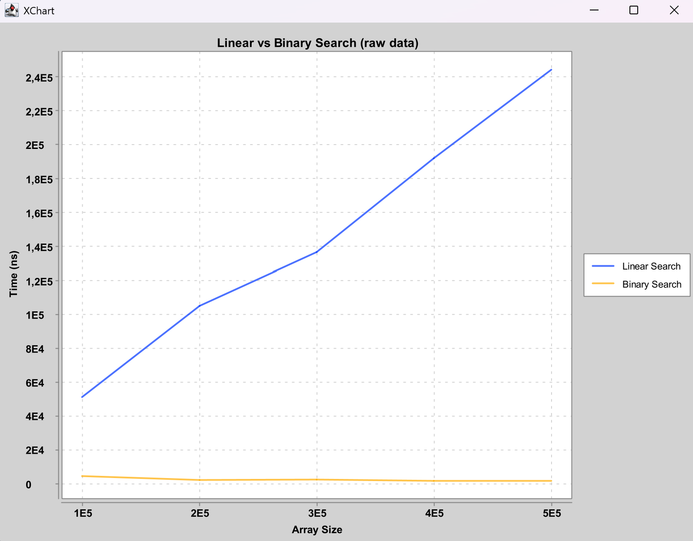
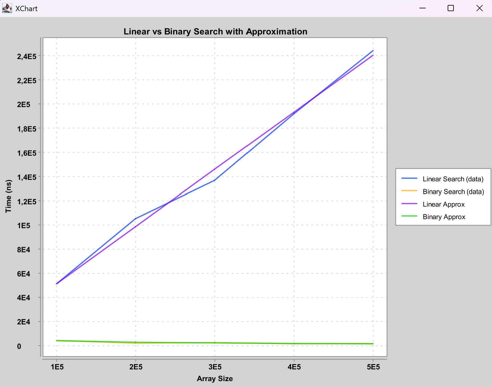
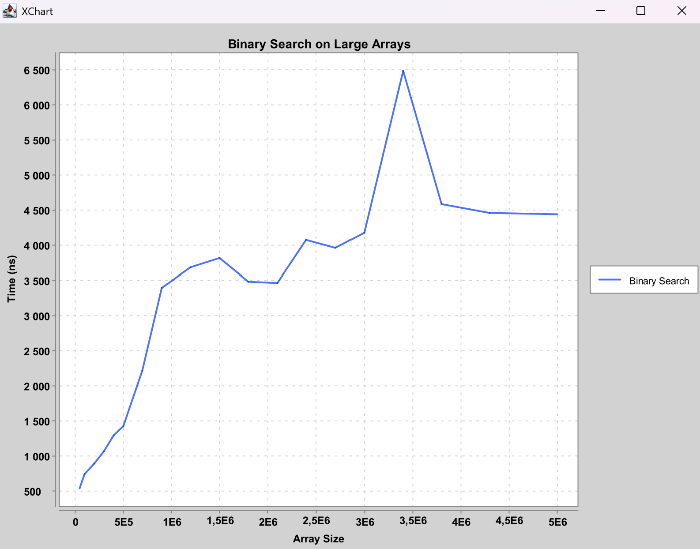
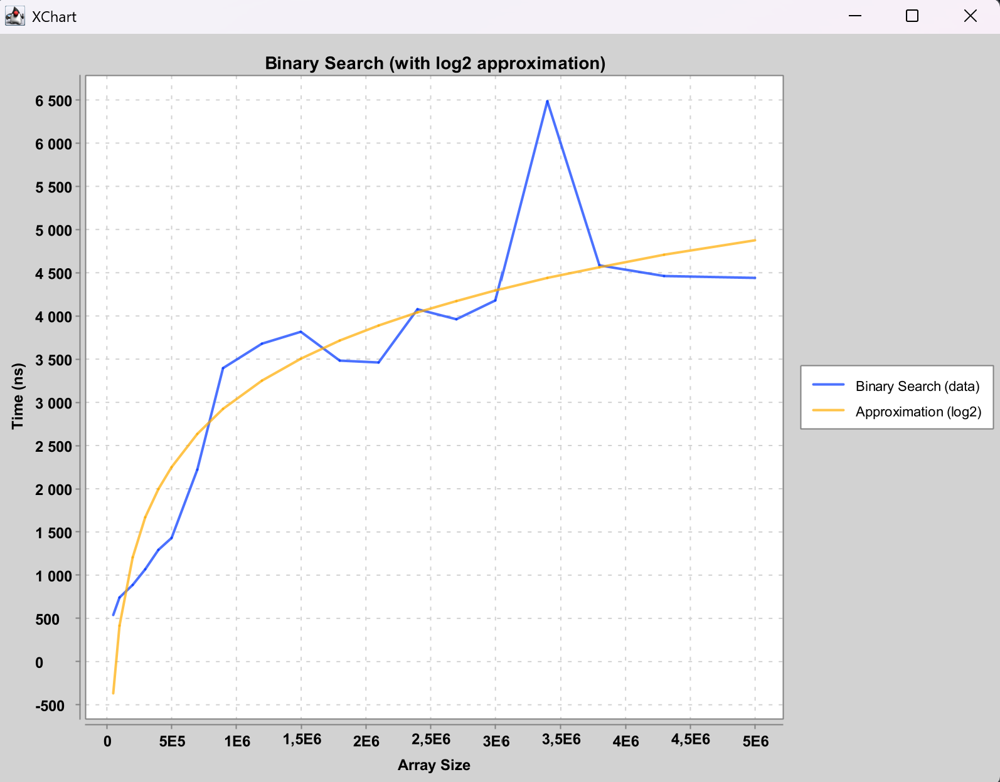

# Отчет по лабораторной работе №1
## Анализ вычислительной сложности линейного и бинарного поиска

**Дата: 20.10.2025**  
**Семестр: 5**  
**Группа: Пиж-б-о-23-2**  
**Дисциплина: анализ сложности алгоритмов**  
**Студент: Шевченко Денис Александрович**  

---

## Цель работы
Изучить понятие вычислительной сложности алгоритмов и на практике подтвердить асимптотические оценки времени выполнения линейного и бинарного поиска: **O(n)** и **O(log n)** соответственно.

---

## Теоретическая часть
Вычислительная сложность характеризует, как изменяются затраты ресурсов (времени, памяти) алгоритма при увеличении размера входных данных `n`.

Для оценки роста используется **асимптотический анализ** и **O-нотация**, которая описывает верхнюю границу роста функции времени выполнения.

Алгоритмы:
- **Линейный поиск (Linear Search)** — перебор элементов по очереди. Сложность: **O(n)**.
- **Бинарный поиск (Binary Search)** — поиск делением отсортированного массива пополам. Сложность: **O(log n)**. Требует предварительной сортировки массива.

---

## Практическая часть

### Выполненные задачи
- Реализован линейный поиск.
- Реализован бинарный поиск.
- Проведен теоретический анализ сложности алгоритмов.
- Выполнено экспериментальное сравнение времени работы на разных размерах массивов.
- Построены графики зависимости времени от размера массива.
- Выполнена аппроксимация экспериментальных данных для подтверждения асимптотики.

### Ключевые фрагменты кода (Kotlin)

#### Линейный поиск
```kotlin
fun linearSearch(list: List<Int>, target: Int): Long {
    val time = measureNanoTime {
        for (index in 0 until list.size) {
            if (list[index] == target) break
        }
    }
    return time
}
// Сложность: O(n)
```

#### Бинарный поиск
```kotlin
fun binarySearch(list: List<Int>, target: Int): Long {
    val time = measureNanoTime {
        var low = 0
        var high = list.size - 1
        while (low <= high) {
            val mid = (low + high) / 2
            when {
                list[mid] == target -> return@measureNanoTime
                list[mid] > target -> high = mid - 1
                else -> low = mid + 1
            }
        }
    }
    return time
}
// Сложность: O(log n)
```

---

## Результаты выполнения

### Описание эксперимента
Для сравнения производительности оба алгоритма тестировались на массивах разных размеров. Для каждого массива выполнялось несколько прогонов с усреднением результата для снижения влияния случайных факторов.

### Построенные графики
В папке report/ находятся изображения:  

Сравнительный график зависимости времени выполнения от размера массива для линейного и бинарного поиска:  


Сравнительный график с аппрокисмацией для большей наглядности вида зависимости:  
  

Т.к. на сравнительном графике тяжело определить вид зависимости у бинарного поиска из-за слишком высокой скорости работы алгоритма, 
была произведена отдельная серия замеров с большими размерами массивов только для бинарного поиска:  
  

Для большей наглядности зависимости была построена аппроксимация:  


### Пример работы программы
```
=== Comparing Linear and Binary Search ===
Array size 100000: Linear avg = 51492 ns, Binary avg = 4722 ns
Array size 200000: Linear avg = 105325 ns, Binary avg = 2412 ns
Array size 300000: Linear avg = 136847 ns, Binary avg = 2715 ns
Array size 400000: Linear avg = 191965 ns, Binary avg = 1872 ns
Array size 500000: Linear avg = 244447 ns, Binary avg = 2027 ns

=== Measuring Binary Search (Detailed) ===
Array size 50000: Binary avg = 540 ns
Array size 100000: Binary avg = 746 ns
Array size 200000: Binary avg = 893 ns
Array size 300000: Binary avg = 1073 ns
Array size 400000: Binary avg = 1300 ns
Array size 500000: Binary avg = 1433 ns
Array size 700000: Binary avg = 2226 ns
Array size 900000: Binary avg = 3400 ns
Array size 1200000: Binary avg = 3686 ns
Array size 1500000: Binary avg = 3820 ns
Array size 1800000: Binary avg = 3486 ns
Array size 2100000: Binary avg = 3466 ns
Array size 2400000: Binary avg = 4080 ns
Array size 2700000: Binary avg = 3966 ns
Array size 3000000: Binary avg = 4180 ns
Array size 3400000: Binary avg = 6486 ns
Array size 3800000: Binary avg = 4586 ns
Array size 4300000: Binary avg = 4466 ns
Array size 5000000: Binary avg = 4446 ns
```

---

## Анализ результатов
- Временная сложность линейного поиска увеличивается примерно линейно с ростом размера массива.
- Временная сложность бинарного поиска растет крайне медленно и визуально почти постоянна при малых массивах.
- Для больших массивов зависимость бинарного поиска хорошо описывается логарифмической функцией.
- Экспериментально подтверждены оценки сложности: **O(n)** и **O(log n)**.

---

## Выводы
- Теоретические оценки сложности линейного и бинарного поиска подтверждены экспериментально.
- Линейный поиск показывает линейную зависимость времени работы от размера входных данных.
- Бинарный поиск значительно эффективнее на больших массивах благодаря логарифмической сложности.
- Аппроксимация по экспериментальным данным позволяет наглядно подтвердить асимптотику.

---

## Ответы на контрольные вопросы

1. **Что такое асимптотическая сложность алгоритма и зачем она нужна?**  
   Это характеристика роста затрат алгоритма при увеличении размера входных данных. Нужна для сравнения алгоритмов независимо от оборудования.

2. **Разница между O(1), O(n) и O(log n)?**  
   - O(1) — постоянное время.  
   - O(n) — линейное время.  
   - O(log n) — логарифмическое время.

3. **Отличие линейного поиска от бинарного?**  
   Линейный перебирает все элементы, бинарный делит отсортированный массив пополам на каждом шаге.

4. **Почему на практике результаты могут отличаться от теории?**  
   Из-за накладных расходов языка, оптимизаций компилятора, кеширования и случайного положения искомого элемента.

5. **Как подтвердить сложность экспериментально?**  
   Измерять время работы на массивах разного размера и анализировать зависимость времени.

---

## Приложения
- Папка `report/` — содержит графики в виде PNG.
- Исходный код проекта на Kotlin.
