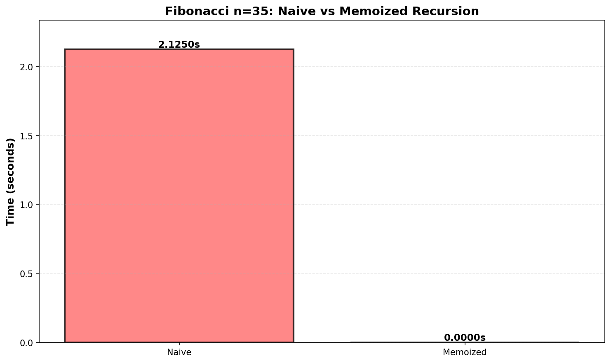
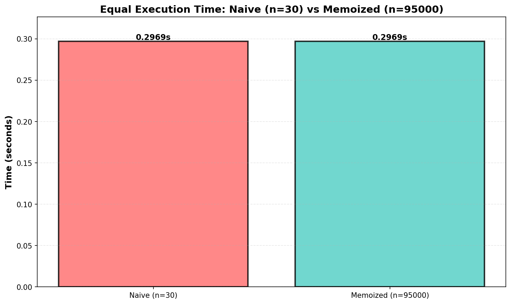
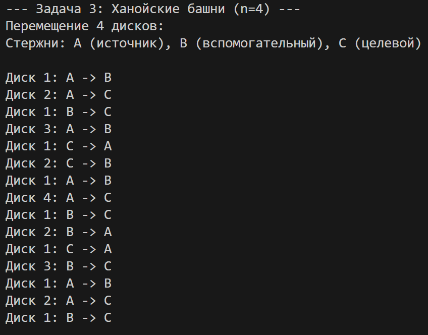

# Отчет по лабораторной работе №3
## Рекурсия

**Дата: 30.11.2025**  
**Семестр: 5**  
**Группа: Пиж-б-о-23-2**  
**Дисциплина: анализ сложности алгоритмов**  
**Студент: Шевченко Денис Александрович**  

---

## Цель работы
Освоить принцип рекурсии, научиться анализировать рекурсивные алгоритмы и понимать механизм работы стека вызовов. Изучить типичные задачи, решаемые рекурсивно, и освоить технику мемоизации для оптимизации рекурсивных алгоритмов. Получить практические навыки реализации и отладки рекурсивных функций.

---

## Теоретическая часть
*   **Рекурсия:** Процесс, при котором функция прямо или косвенно вызывает саму себя для решения задачи.
*   **Базовый случай (условие выхода):** Обязательное условие, которое прекращает рекурсивные вызовы и предотвращает зацикливание.
*   **Рекурсивный шаг:** Шаг, на котором задача разбивается на более простую подзадачу того же типа и производится рекурсивный вызов.
*   **Глубина рекурсии:** Количество вложенных вызовов функции. Ограничена размером стека вызовов.
*   **Стек вызовов (Call Stack):** Структура данных, которая хранит информацию о незавершенных вызовах функций (локальные переменные, адрес возврата).
*   **Мемоизация (Memoization):** Техника оптимизации, позволяющая избежать повторных вычислений результатов функций для одних и тех же входных данных путем сохранения ранее вычисленных результатов в кеше (например, в словаре).

---

## Практическая часть

**Задание:**

1.  Реализовать классические рекурсивные алгоритмы.
2.  Проанализировать их временную сложность и глубину рекурсии.
3.  Реализовать оптимизацию рекурсивных алгоритмов с помощью мемоизации.
4.  Сравнить производительность наивной рекурсии и рекурсии с мемоизацией.
5.  Решить практические задачи с применением рекурсии.

**Шаги выполнения:**

1.  **Создание проекта:** Создать файлы `recursion.hs`, `memoization.hs`, `tasks.hs`.
2.  **Реализация рекурсивных алгоритмов (в `recursion.hs`):**
    *   Вычисление факториала числа `n`.
    *   Вычисление `n`-го числа Фибоначчи.
    *   Быстрое возведение числа `a` в степень `n` (через степень двойки).
    *   **После каждой функции в комментарии указать её временную сложность и глубину рекурсии.**
3.  **Оптимизация с помощью мемоизации (в `memoization.hs`):**
    *   Реализовать мемоизированную версию функции для чисел Фибоначчи.
    *   Сравнить количество рекурсивных вызовов и время работы наивной и мемоизированной версии для `n=35`.
4.  **Решение практических задач (в `recursion_tasks.hs`):**
    *   Реализовать алгоритм бинарного поиска с использованием рекурсии.
    *   Реализовать рекурсивный обход файловой системы (вывод дерева каталогов и файлов, начиная с заданного пути).
    *   Решить задачу "Ханойские башни" для `n` дисков.
5.  **Экспериментальное исследование:**
    *   Замерить время выполнения наивного и мемоизированного вычисления чисел Фибоначчи для разных `n`.
    *   Измерить максимальную глубину рекурсии для обхода файловой системы на глубоко вложенной структуре каталогов.
    *   **ВАЖНО: Все замеры проводить на одной вычислительной машине.**
6.  **Визуализация:**
    *   Построить график времени выполнения рекурсивного вычисления Фибоначчи с мемоизацией и без.
    *   Для задачи "Ханойские башни" вывести на экран последовательность перемещений дисков.
7.  **Анализ результатов:**
    *   Объяснить экспоненциальный рост времени выполнения наивного алгоритма Фибоначчи.
    *   Проанализировать, как мемоизация меняет сложность алгоритма.
8.  **Оформление отчета:** Результаты оформить в файле `README.md`. Код должен соответствовать PEP8.
9.  **Контроль версий:** Стратегия ветвления – GitHub Flow.

### Ключевые фрагменты кода (Haskell)

#### recursion.hs
```haskell
-- Вычисление факториала числа n
factorial :: Integer -> Integer
factorial 0 = 1
factorial n
  | n > 0     = n * factorial (n - 1)
  | otherwise = error "factorial: отрицательное n"
-- Временная сложность: O(n)
-- Глубина рекурсии: n (рекурсивный стек растёт линейно по n)

-- Вычисление n-го числа Фибоначчи (простая рекурсивная версия)
fib :: Integer -> Integer
fib 0 = 0
fib 1 = 1
fib n
  | n > 1     = fib (n - 1) + fib (n - 2)
  | otherwise = error "fib: отрицательное n"
-- Временная сложность: O(2^n) (экспоненциальная)
-- Глубина рекурсии: n (максимальная глубина рекурсии равна n)

-- Быстрое возведение числа a в степень n (через степень двойки)
fastPow :: (Integral b, Num a) => a -> b -> a
fastPow _ 0 = 1
fastPow a n
  | n < 0     = error "fastPow: отрицательная степень не поддерживается"
  | even n    = let half = fastPow a (n `div` 2) in half * half
  | otherwise = a * fastPow a (n - 1)
-- Временная сложность: O(log n) (для n>0) — каждый шаг делит показатель на 2
-- Глубина рекурсии: O(log n) (стек рекурсии растёт примерно на log2(n))
```

#### Сравнение эффективности мемоизированной и наивной рекурсий для чисел Фибоначчи
```haskell
naiveFibCount :: IORef Integer -> Integer -> IO Integer
naiveFibCount counter 0 = do
  modifyIORef' counter (+1)
  return 0
naiveFibCount counter 1 = do
  modifyIORef' counter (+1)
  return 1
naiveFibCount counter n = do
  modifyIORef' counter (+1)
  a <- naiveFibCount counter (n-1)
  b <- naiveFibCount counter (n-2)
  return (a + b)

memoFibCount :: IORef Integer -> Int -> IO Integer
memoFibCount counter n = do
  arr <- newArray (0, n) (-1) :: IO (IOArray Int Integer)
  let go :: Int -> IO Integer
      go 0 = do
        modifyIORef' counter (+1)
        return 0
      go 1 = do
        modifyIORef' counter (+1)
        return 1
      go k = do
        v <- readArray arr k
        if v /= (-1)
          then return v
          else do
            modifyIORef' counter (+1)
            x <- go (k-1)
            y <- go (k-2)
            let !r = x + y
            writeArray arr k r
            return r
  go n

timeAction :: IO a -> IO (a, Double)
timeAction action = do
  start <- getCPUTime
  res <- action
  _ <- evaluate res
  end <- getCPUTime
  let diff = fromIntegral (end - start) / (1e12 :: Double)
  return (res, diff)
```

#### Выполнение задач
```haskell
-- Задача 1: Бинарный поиск
  putStrLn "\n--- Задача 1: Бинарный поиск ---"
  let sortedList = [1, 3, 5, 7, 9, 11, 13, 15, 17, 19] :: [Int]
  putStrLn $ "Массив: " ++ show sortedList
  
  let testValues = [5, 10, 19, 20]
  putStrLn "\nРезультаты поиска:"
  mapM_ (\x -> do
    let found = binarySearch x sortedList
    let idx = binarySearchIdx x sortedList
    putStrLn $ "  Значение " ++ show x ++ ": " ++ 
      (if found then "найдено (индекс " ++ show idx ++ ")" else "не найдено")) 
    testValues
  
  -- Задача 2: Обход файловой системы
  putStrLn "\n--- Задача 2: Обход файловой системы ---"
  let startPath = "."
  putStrLn $ "Начало обхода с: " ++ startPath
  
  maxDepthRef <- newIORef 0
  traverseDir startPath 0 maxDepthRef
  maxDepth <- readIORef maxDepthRef
  putStrLn $ "\nМаксимальная глубина рекурсии: " ++ show maxDepth
  
  -- Задача 3: Ханойские башни
  putStrLn "\n--- Задача 3: Ханойские башни (n=4) ---"
  let n = 4
  putStrLn $ "Перемещение " ++ show n ++ " дисков:"
  putStrLn "Стержни: A (источник), B (вспомогательный), C (целевой)\n"
  
  moveCount <- hanoi n "A" "C" "B"
  putStrLn $ "\nВсего перемещений: " ++ show moveCount
  putStrLn $ "Теоретическое количество: " ++ show (hanoiCount n)
``` 

---

### Описание эксперимента
Для сравнения эффективности работы наивной и мемоизированной рекурсий для вычисления чисел Фибонначи, первым делом, производился замер для одинакового n=35, а после, замер для разных n, чтобы продемонстрировать, при каких n время работы алгоритмов будет близким.

### Построенные графики
В папке report/ находятся изображения:  

Сравнительный график вычисления чисел Фибонначи при n=35:  


Сравнительный график разных n при близком времени вычисления ряда чисел Фибонначи:  


Порядок перемещания дисков при решении Ханойских башен:


## Анализ результатов
- Мемоизированная рекурсия намного превосходит наивную в скорости вычислений ряда чисел Фибонначи.
---

## Выводы
- Мемоизированная функция демонстрирует значительно более высокую скорость работы, но для её применения требуются большие затраты памяти. 
---

### Характеристики ПК
* Объем ОЗУ: 24 Гб 
* Скорость ОЗУ: 6400 МТ/с 
* Количество ядер процессора: 8 
* Потоков процессора: 16 
* Частоты процессора: базовая- 3800 MHz, TurboBoost- 5100 MHz 
* Внутренняя память процессора: L1- 8x32+8x32КБ, L2- 8x1024КБ, L3- 16384КБ 
* ОС: Win11 
---

## Ответы на контрольные вопросы

1. Что такое базовый случай и рекурсивный шаг в рекурсивной функции? Почему отсутствие базового случая приводит к ошибке? 
Базовый случай в рекурсивной функции задаёт условие остановки, рекурсивный шаг - разбиение задачи на меньшие подзадачи. Без базового случая функция вызывает сама себя бесконечно, что приводит к ошибке переполнения стека. 
2. Объясните, как работает механизм мемоизации. Как он меняет временную сложность вычисления чисел Фибоначчи по сравнению с наивной рекурсией? Мемоизация сохраняет результаты уже вычисленных вызовов, чтобы при повторном обращении возвращать их без повторных вычислений. Для чисел Фибоначчи это снижает временную сложность с экспоненциальной у наивной рекурсии до линейной. 
3. В чем заключается основная проблема глубокой рекурсии и как она связана со стеком вызовов? 
Проблема глубокой рекурсии в переполнении стека вызовов: каждый вызов функции занимает место в стеке, и при слишком большой глубине память стека заканчивается. 
4. Задача о Ханойских башнях решается рекурсивно. Опишите алгоритм решения для 3 дисков. 
Алгоритм Ханойских башен для 3 дисков: первый диск переносим на промежуточный стержень, второй на целевой, первый с промежуточного на целевой, третий с исходного на промежуточный, первый и второй с промежуточного на целевой, и так далее, пока все диски не окажутся на целевом стержне, соблюдая правило, что больший диск не может лежать на меньшем. 
5. Рекурсивный и итеративный алгоритмы могут решать одни и те же задачи. Назовите преимущества и недостатки каждого подхода. 
Рекурсивные алгоритмы проще для понимания и записи сложных задач, но могут приводить к переполнению стека. Итеративные обычно экономнее по памяти и быстрее, но код может быть сложнее для восприятия. 

---

## Приложения
- Папка `report/` - содержит графики в виде PNG.
- Исходный код на haskell.
