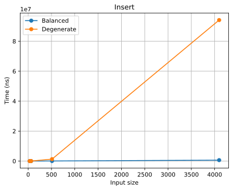
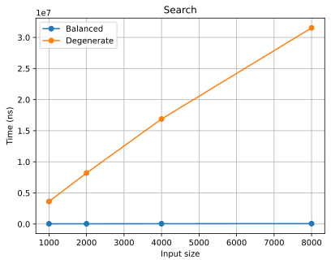
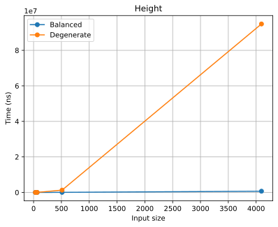

# Отчет по лабораторной работе 6

## Деревья. Бинарные деревья поиска

**Семестр:** 3 курс, 5 семестр
**Группа:** ПИЖ-б-о-23-2
**Дисциплина:** Алгоритмы и структуры данных
**Студент:** Шевченко Денис

## Цель работы

Изучить древовидные структуры данных, их свойства и применение. Освоить основные операции с бинарными деревьями поиска (BST). Получить практические навыки реализации BST на основе узлов (pointer-based), рекурсивных алгоритмов обхода и анализа их эффективности. Исследовать влияние сбалансированности дерева на производительность операций.

## Теоретическая часть

* **Дерево:** Рекурсивная структура данных, состоящая из узлов, где каждый узел имеет значение и ссылки на дочерние узлы.
* **Бинарное дерево поиска (BST):** Дерево, для которого выполняются следующие условия:
  * Значение в левом поддереве любого узла **меньше** значения в самом узле.
  * Значение в правом поддереве любого узла **больше** значения в самом узле.
  * Оба поддерева являются бинарными деревьями поиска.
* **Основные операции BST:**
  * **Вставка (Insert):** Сложность: в среднем O(log n), в худшем (вырожденное дерево) O(n).
  * **Поиск (Search):** Сложность: в среднем O(log n), в худшем O(n).
  * **Удаление (Delete):** Сложность: в среднем O(log n), в худшем O(n). Имеет три случая: удаление листа, узла с одним потомком, узла с двумя потомками.
  * **Обход (Traversal):**
    * **In-order (левый-корень-правый):** Посещает узлы в порядке возрастания. Сложность O(n).
    * **Pre-order (корень-левый-правый):** Полезен для копирования структуры дерева. Сложность O(n).
    * **Post-order (левый-правый-корень):** Полезен для удаления дерева. Сложность O(n).
* **Сбалансированные деревья:** Деревья с контролем высоты (например, AVL, Красно-черные), которые гарантируют время операций O(log n) даже в худшем случае.

 **Двойное хеширование (Double Hashing):** Метод открытой адресации, использующий вторую хеш-функцию для определения шага probing.

## Практическая часть

### Основные компоненты

#### 1. Класс `BinarySearchTree<T>`

**Основные операции:**
* `insert(value)` - вставка элемента (средняя O(log n), худшая O(n))
* `search(value)` - поиск элемента (средняя O(log n), худшая O(n))
* `remove(value)` - удаление элемента (средняя O(log n), худшая O(n))

**Дополнительные методы:**
* `findMin()` - поиск минимума (O(log n) / O(n))
* `findMax()` - поиск максимума (O(log n) / O(n))
* `height()` - вычисление высоты дерева (O(n))
* `isValidBST()` - проверка корректности BST (O(n))
* `visualize()` - текстовая визуализация дерева

### Ключевые фрагменты кода

#### Алгоритм вставки элемента

```cpp
template<typename T>
TreeNode<T>* BinarySearchTree<T>::insert(TreeNode<T>* node, const T& value) {
    // Базовый случай - достигли места для вставки
    if (node == nullptr) {
        return new TreeNode<T>(value);
    }
    
    // Рекурсивный спуск в зависимости от значения
    if (value < node->data) {
        node->left.reset(insert(node->left.release(), value));
    } else if (value > node->data) {
        node->right.reset(insert(node->right.release(), value));
    }
    
    return node;
}
```

#### Алгоритм поиска элемента

```cpp
template<typename T>
TreeNode<T>* BinarySearchTree<T>::search(TreeNode<T>* node, const T& value) const {
    // Базовые случаи: дерево пусто или значение найдено
    if (node == nullptr || node->data == value) {
        return node;
    }
    
    // Рекурсивный поиск в соответствующем поддереве
    if (value < node->data) {
        return search(node->left.get(), value);
    } else {
        return search(node->right.get(), value);
    }
}
```

#### Симметричный обход дерева (In-order)

```cpp
template<typename T>
std::vector<T> TreeTraversal<T>::inOrder(TreeNode<T>* node) {
    // Симметричный обход: левый-корень-правый
    std::vector<T> result;
    if (node == nullptr) return result;
    
    // Обход левого поддерева
    auto leftResult = inOrder(node->left.get());
    result.insert(result.end(), leftResult.begin(), leftResult.end());
    
    // Посещение корня
    result.push_back(node->data);
    
    // Обход правого поддерева
    auto rightResult = inOrder(node->right.get());
    result.insert(result.end(), rightResult.begin(), rightResult.end());
    
    return result;
}
```

### Бенчмарки 

Проведено исследование производительности для **сбалансированных** и **вырожденных** деревьев:

#### Вставка элементов
* **Сбалансированное дерево:** O(n log n)
* **Вырожденное дерево:** O(n²)

#### Поиск элементов
* **Сбалансированное дерево:** O(log n)  
* **Вырожденное дерево:** O(n)

#### Вычисление высоты
* **Сбалансированное дерево:** O(log n)
* **Вырожденное дерево:** O(n)

## Анализ результатов

### Графики производительности

#### Вставка элементов



#### Поиск элементов



#### Вычисление высоты



### Производительность вставки

| Размер | Сбалансированное (мс) | Вырожденное (мс) | Разница |
|--------|----------------------|-------------------|---------|
| 32     | 0.002               | 0.005             | 2.3x    |
| 64     | 0.005               | 0.021             | 4.5x    |
| 512    | 0.055               | 1.345             | 24.5x   |
| 4096   | 0.661               | 96.453            | **146x** |

### Производительность поиска

| Размер | Сбалансированное (мс) | Вырожденное (мс) | Разница |
|--------|----------------------|-------------------|---------|
| 1000   | 0.051               | 3.585             | 69.8x   |
| 2000   | 0.050               | 8.845             | 177.7x  |
| 4000   | 0.058               | 17.833            | 305.3x  |
| 8000   | 0.061               | 34.326            | **560x**|

### Ключевые выводы

1. **Влияние структуры дерева критично:** вырожденные деревья могут быть на порядки медленнее
2. **Подтверждение теоретической сложности:** эмпирические данные соответствуют теоретическим оценкам
3. **Масштабируемость:** с ростом размера данных разница в производительности увеличивается экспоненциально

## Визуализация дерева

Реализована текстовая визуализация дерева (поворот на 90° против часовой стрелки):

```
        8
    7
        6
5
        4
    3
        2
```

## Контрольные вопросы

### 1. Основное свойство бинарного дерева поиска (BST)

**Ответ:** Для любого узла в BST:
* Все значения в левом поддереве меньше значения узла
* Все значения в правом поддереве больше значения узла
* Оба поддерева также являются BST

### 2. Алгоритм вставки нового элемента

**Ответ:**

1. Если дерево пусто - создаем корневой узел
2. Иначе рекурсивно спускаемся:
   * Если значение меньше текущего узла - идем влево
   * Если значение больше текущего узла - идем вправо
   * Если узел не существует - создаем его

**Сложность:** O(log n) для сбалансированного, O(n) для вырожденного

### 3. Разница между обходами DFS и BFS

**Ответ:**
* **DFS (обход в глубину)**: исследует как можно глубже по каждой ветке перед возвращением
  * Виды: in-order, pre-order, post-order
* **BFS (обход в ширину)**: исследует все узлы на текущем уровне перед переходом на следующий

### 4. Почему вырожденное BST имеет сложность O(n)

**Ответ:** В вырожденном дереве элементы вставляются в отсортированном порядке, создавая структуру, похожую на связанный список. При этом:
* Вставка: нужно пройти через все существующие элементы
* Поиск: в худшем случае нужно проверить все элементы
* Высота дерева становится равной количеству элементов

### 5. Сбалансированные деревья (AVL)

**Ответ:** AVL-деревья поддерживают баланс высот левого и правого поддеревьев для каждого узла (разница не более 1). Это гарантирует:
* Высота дерева всегда O(log n)
* Все основные операции имеют сложность O(log n) даже в худшем случае
* Достигается за счет поворотов при вставке/удалении

