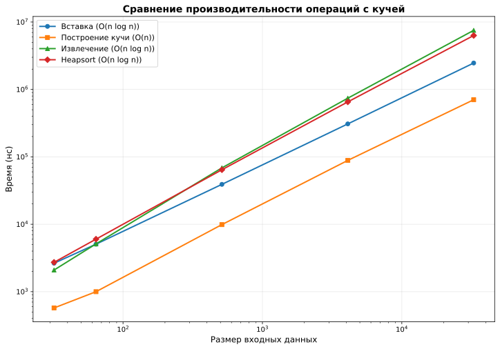
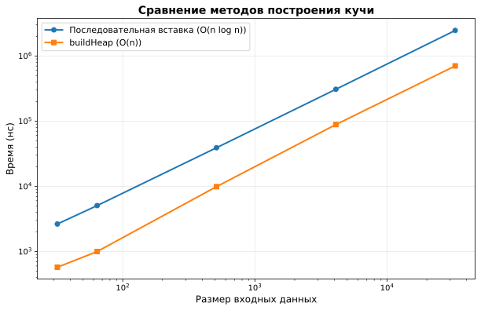
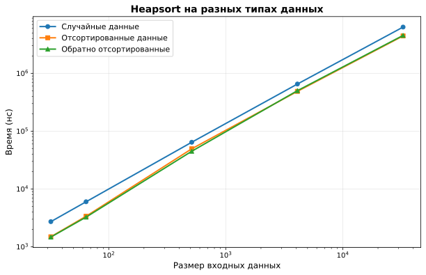

# Отчет по лабораторной работе 7

## Кучи (Heaps)

**Семестр:** 3 курс, 5 семестр  
**Группа:** ПИЖ-б-о-23-2  
**Дисциплина:** Алгоритмы и структуры данных  
**Студент:** Шевченко Денис

## Цель работы

Изучить структуру данных "куча" (heap), её свойства и применение. Освоить основные операции с кучей (добавление, извлечение корня) и алгоритм её построения. Получить практические навыки реализации кучи на основе массива (array-based). Исследовать эффективность основных операций и применение кучи для сортировки и реализации приоритетной очереди.

## Теоретическая часть

* **Куча (Heap):** Специализированная древовидная структура данных, удовлетворяющая свойству кучи. Является **полным бинарным деревом** (все уровни заполнены, кроме последнего, который заполняется слева направо).

*   **Свойство кучи:**
    *   **Min-Heap:** Значение в любом узле **меньше или равно** значениям его потомков. Корень — минимальный элемент.
    *   **Max-Heap:** Значение в любом узле **больше или равно** значениям его потомков. Корень — максимальный элемент.
*   **Реализация:** Куча эффективно реализуется на основе **массива**. Для узла с индексом `i`:
    *   Индекс родителя: `(i-1)//2`
    *   Индекс левого потомка: `2*i + 1`
    *   Индекс правого потомка: `2*i + 2`
*   **Основные операции:**
    *   **Вставка (Insert):** Элемент добавляется в конец массива и "всплывает" (sift-up) до восстановления свойства кучи. Сложность: O(log n).
    *   **Извлечение корня (Extract):** Корень (элемент `[0]`) извлекается, последний элемент ставится на его место и "погружается" (sift-down) до восстановления свойства кучи. Сложность: O(log n).
    *   **Построение кучи (Heapify):** Преобразование произвольного массива в кучу. Может быть выполнено алгоритмом со сложностью O(n).
*   **Применение:**
    *   Сортировка кучей (Heapsort).
    *   Реализация приоритетной очереди.
    *   Алгоритм Дейкстры.

## Практическая часть

### Основные компоненты

#### 1. Класс `Heap<T>`

**Основные операции:**
* `insert(value)` - вставка элемента - **O(log n)**
* `extract()` - извлечение корня - **O(log n)**
* `peek()` - просмотр корня без извлечения - **O(1)**
* `buildHeap(array)` - построение кучи из массива - **O(n)**

**Внутренние методы:**
* `siftUp(index)` - всплытие элемента - **O(log n)**
* `siftDown(index)` - погружение элемента - **O(log n)**
* `visualize()` - визуализация кучи в виде дерева - **O(n)**

### Ключевые фрагменты кода

#### Алгоритм всплытия элемента (sift-up)

```cpp
template<typename T>
void Heap<T>::siftUp(size_t index) {
    while (index > 0 && compare(data[index], data[parent(index)])) {
        std::swap(data[index], data[parent(index)]);
        index = parent(index);
    }
}
```

#### Алгоритм погружения элемента (sift-down)

```cpp
template<typename T>
void Heap<T>::siftDown(size_t index) {
    while (true) {
        size_t target = index;
        size_t l = left(index);
        size_t r = right(index);

        if (l < data.size() && compare(data[l], data[target])) {
            target = l;
        }
        if (r < data.size() && compare(data[r], data[target])) {
            target = r;
        }

        if (target == index) {
            break;
        }

        std::swap(data[index], data[target]);
        index = target;
    }
}
```

#### Построение кучи из массива (buildHeap)

```cpp
template<typename T>
void Heap<T>::buildHeap(const std::vector<T>& arr) {
    data = arr;
    
    // Начинаем с последнего нелистового узла
    for (int i = static_cast<int>(data.size() / 2) - 1; i >= 0; --i) {
        siftDown(static_cast<size_t>(i));
    }
}
```

#### Алгоритм Heapsort (in-place)

```cpp
template<typename T>
void heapsort(std::vector<T>& arr) {
    if (arr.empty()) {
        return;
    }

    // Построение max-heap - O(n)
    for (int i = static_cast<int>(arr.size() / 2) - 1; i >= 0; --i) {
        heapifyDown(arr, arr.size(), static_cast<size_t>(i), true);
    }

    // Извлечение элементов из кучи - O(n log n)
    for (size_t i = arr.size() - 1; i > 0; --i) {
        std::swap(arr[0], arr[i]);
        heapifyDown(arr, i, 0, true);
    }
}
```

### Бенчмарки

#### Сравнение всех операций



#### Сравнение методов построения кучи



#### Heapsort на разных типах данных



### Ключевые выводы

1. **Эффективность buildHeap:** Алгоритм `buildHeap` значительно быстрее последовательной вставки элементов, так как имеет сложность O(n) против O(n log n).

2. **Стабильность Heapsort:** Heapsort демонстрирует стабильную производительность O(n log n) на всех типах данных (случайные, отсортированные, обратно отсортированные), что является его преимуществом перед QuickSort.

3. **Подтверждение теоретической сложности:** Эмпирические данные соответствуют теоретическим оценкам сложности операций.

4. **Применение кучи:** Куча эффективно реализует приоритетную очередь, обеспечивая быстрый доступ к элементу с наивысшим (или наименьшим) приоритетом.

## Визуализация кучи

Реализована текстовая визуализация кучи в виде дерева. Метод `visualize()` выводит структуру кучи, где корень находится вверху, а потомки располагаются ниже:

```
Min-Heap:
└── 1
    ├── 2
    │   ├── 3
    │   │   ├── 9
    │   │   └── 4
    │   └── 5
    └── 6
        ├── 8
        └── 7
```

## Контрольные вопросы

### 1. Основное свойство min-кучи и max-кучи

**Ответ:** 
* **Min-Heap:** Значение в любом узле меньше или равно значениям его потомков. Корень содержит минимальный элемент.
* **Max-Heap:** Значение в любом узле больше или равно значениям его потомков. Корень содержит максимальный элемент.

### 2. Алгоритм операции вставки нового элемента в кучу (процедура `sift_up`)

**Ответ:**

1. Элемент добавляется в конец массива (последний лист дерева)
2. Выполняется процедура `sift_up`:
   * Сравниваем элемент с родителем
   * Если свойство кучи нарушено, меняем местами с родителем
   * Повторяем для нового положения элемента
   * Процесс продолжается до восстановления свойства кучи или достижения корня

**Сложность:** O(log n), так как в худшем случае элемент поднимается от листа до корня (высота дерева).

### 3. Временная сложность построения кучи из произвольного массива и почему она равна O(n), а не O(n log n)?

**Ответ:**

Сложность O(n) достигается благодаря алгоритму `buildHeap`, который:
1. Начинает с последнего нелистового узла (индекс `n/2 - 1`)
2. Выполняет `sift_down` для каждого нелистового узла снизу вверх
3. Количество операций `sift_down` на каждом уровне уменьшается с ростом уровня

Математический анализ показывает, что сумма операций составляет O(n), а не O(n log n), потому что:
- Большинство узлов находятся на нижних уровнях, где `sift_down` выполняется за малое число шагов
- Только небольшое количество узлов на верхних уровнях требует O(log n) операций

### 4. Алгоритм пирамидальной сортировки (Heapsort)

**Ответ:**

1. **Построение max-heap:** Преобразуем исходный массив в max-heap за O(n)
2. **Сортировка:**
   * Меняем местами корень (максимум) с последним элементом
   * Уменьшаем размер кучи на 1
   * Выполняем `sift_down` для корня, чтобы восстановить свойство кучи
   * Повторяем до тех пор, пока размер кучи не станет равен 1

**Сложность:** O(n log n) в худшем, среднем и лучшем случае.

**Преимущества:**
* In-place сортировка (не требует дополнительной памяти)
* Гарантированная сложность O(n log n)
* Стабильная производительность на всех типах данных

### 5. Почему кучу часто используют для реализации приоритетной очереди?

**Ответ:**

Куча идеально подходит для приоритетной очереди, потому что:

1. **Быстрый доступ к приоритетному элементу:** O(1) для просмотра корня
2. **Эффективная вставка:** O(log n) для добавления элемента
3. **Эффективное извлечение:** O(log n) для удаления элемента с наивысшим приоритетом
4. **Компактное хранение:** Использует массив, что эффективнее по памяти, чем указатели

**Операции приоритетной очереди:**
* `enqueue(item, priority)` - добавление элемента - **O(log n)**
* `dequeue()` - извлечение элемента с наивысшим приоритетом - **O(log n)**
* `peek()` - просмотр элемента с наивысшим приоритетом - **O(1)**
