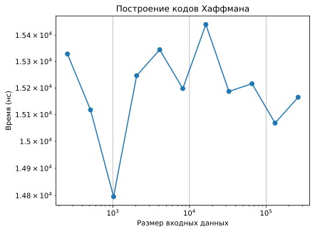
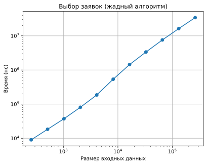
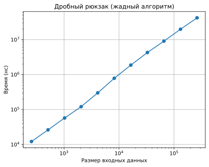

# Отчет по лабораторной работе 8

## Жадные алгоритмы

**Семестр:** 3 курс, 5 семестр  
**Группа:** ПИЖ-б-о-23-2  
**Дисциплина:** Алгоритмы и структуры данных  
**Студент:** Шевченко Денис

## Цель работы

Изучить метод проектирования алгоритмов, известный как "жадный алгоритм". Освоить принцип принятия локально оптимальных решений на каждом шаге и понять условия, при которых этот подход приводит к глобально оптимальному решению. Получить практические навыки реализации жадных алгоритмов для решения классических задач, анализа их корректности и оценки эффективности.

## Теоретическая часть

* **Жадный алгоритм:** Алгоритм, который на каждом шаге принимает **локально оптимальное решение** в надежде, что итоговое решение будет **глобально оптимальным**.
*   **Ключевые характеристики:**
    *   **Жадный выбор:** На каждом шаге выбирается лучший из доступных вариантов в данный момент, без учета последствий для будущих шагов.
    *   **Оптимальная подструктура:** Оптимальное решение задачи содержит в себе оптимальные решения её подзадач.
*   **Области применения:** Жадные алгоритмы эффективны для задач, где выбор, сделанный на каждом шаге, не ухудшает возможности достижения глобального оптимума. Они часто работают быстро (полиномиальное время), но **не всегда приводят к оптимальному решению**.
*   **Классические задачи:**
    *   **Задача о выборе заявок (Interval Scheduling):** Выбор максимального количества непересекающихся интервалов.
    *   **Задача о рюкзаке (Непрерывная/Дробная):** Выбор предметов с максимальной суммарной стоимостью, если можно брать части предметов.
    *   **Алгоритм Хаффмана:** Оптимальное префиксное кодирование для сжатия данных.
    *   **Построение минимального остовного дерева (Алгоритмы Прима и Краскала):** (Хотя это и графовый алгоритм, он является классическим примером жадного подхода).

## Практическая часть

### Ключевые фрагменты кода

#### Жадный выбор заявок

```cpp
std::vector<Interval> selectIntervalsGreedy(std::vector<Interval> intervals) {
    // Сортируем интервалы по времени окончания (жадный критерий)
    std::sort(intervals.begin(), intervals.end(), [](const Interval& a, const Interval& b) {
        if (a.end == b.end) {
            return a.start < b.start;
        }
        return a.end < b.end;
    });

    std::vector<Interval> result;
    int current_end = -1e9;

    for (const auto& interval : intervals) {
        if (interval.start >= current_end) {
            result.push_back(interval);
            current_end = interval.end;
        }
    }

    return result;
}
```

#### Дробный рюкзак

```cpp
FractionalKnapsackResult fractionalKnapsackGreedy(const std::vector<Item>& items, double capacity) {
    struct WithIndex {
        Item item;
        std::size_t index;
    };

    std::vector<WithIndex> sorted;
    sorted.reserve(items.size());
    for (std::size_t i = 0; i < items.size(); ++i) {
        sorted.push_back({items[i], i});
    }

    // Сортируем по убыванию удельной стоимости (value / weight)
    std::sort(sorted.begin(), sorted.end(), [](const WithIndex& a, const WithIndex& b) {
        double ra = a.item.value / a.item.weight;
        double rb = b.item.value / b.item.weight;
        return ra > rb;
    });

    FractionalKnapsackResult result{};
    result.max_value = 0.0;
    result.fractions.assign(items.size(), 0.0);

    double remaining = capacity;

    for (const auto& wi : sorted) {
        if (remaining <= 0) break;
        if (wi.item.weight <= remaining) {
            // Берем предмет целиком
            result.fractions[wi.index] = 1.0;
            result.max_value += wi.item.value;
            remaining -= wi.item.weight;
        } else {
            // Берем только доступную долю
            double fraction = remaining / wi.item.weight;
            result.fractions[wi.index] = fraction;
            result.max_value += wi.item.value * fraction;
            remaining = 0;
        }
    }

    return result;
}

```

#### Алгоритм Хаффмана

```cpp
std::unordered_map<char, std::string> buildHuffmanCodes(const std::unordered_map<char, int>& frequencies) {
    if (frequencies.empty()) return {};

    std::priority_queue<NodePtrWrapper, std::vector<NodePtrWrapper>, HuffmanCompare> pq;

    // Создаем листовые узлы
    for (const auto& [ch, freq] : frequencies) {
        pq.push(NodePtrWrapper{new HuffmanNode(ch, freq)});
    }

    // Строим дерево Хаффмана, пока не останется один корень
    while (pq.size() > 1) {
        auto left = pq.top().node;
        pq.pop();
        auto right = pq.top().node;
        pq.pop();

        int sum = left->frequency + right->frequency;
        auto parent = new HuffmanNode('\0', sum, left, right);
        pq.push(NodePtrWrapper{parent});
    }

    HuffmanNode* root = pq.top().node;
    std::unordered_map<char, std::string> codes;
    buildCodesDfs(root, "", codes);

    // Освобождаем дерево
    freeHuffmanTree(root);

    return codes;
}
```

## Бенчмарки

Измерялось время работы:

* построения кодов Хаффмана `BM_HuffmanBuild` в зависимости от длины входной строки;
* выбора заявок `BM_IntervalScheduling` от числа интервалов;
* дробного рюкзака `BM_FractionalKnapsack` от количества предметов.

### Графики производительности

#### Построение кодов Хаффмана



#### Жадный выбор заявок



#### Дробный рюкзак



## Выводы

* Жадные алгоритмы просты в реализации и, как правило, очень быстры, однако требуют строгого обоснования корректности жадного выбора.
* Для задач, обладающих свойствами жадного выбора и оптимальной подструктуры (interval scheduling, дробный рюкзак, Хаффман), жадный подход даёт оптимальный результат и хорошо масштабируется.
* Для более сложных постановок (дискретный рюкзак, произвольные системы монет) жадные алгоритмы могут давать лишь приближённые решения, поэтому требуется сравнение с точными методами (перебор, динамическое программирование).

### 1. В чем заключается основная идея жадных алгоритмов?

**Ответ:**  
Жадные алгоритмы на каждом шаге принимают локально оптимальное решение в надежде, что оно приведёт к глобальному оптимуму.

### 2. Для задачи о выборе заявок (Interval Scheduling) жадный алгоритм, выбирающий интервалы с наименьшим временем окончания, является оптимальным. Объясните, почему эта жадная стратегия работает.

**Ответ:**  
Выбор интервала, завершающегося раньше всех, максимизирует оставшееся время для размещения других заявок. Это позволяет всегда сохранить оптимальное количество непересекающихся интервалов, что гарантирует глобальную оптимальность.

### 3. Приведите пример задачи, для которой жадный алгоритм дает оптимальное решение, и задачи, для которой он не дает.

**Ответ:**  
Оптимально: задача о выборе заявок или построение кода Хаффмана.  
Не оптимально: задача о 0-1 рюкзаке — жадный выбор по максимальной ценности/весу может привести к подоптимальному решению.

### 4. В чем разница между непрерывной (дробной) и дискретной (0-1) задачами о рюкзаке? Для какой из них жадный алгоритм оптимален?

**Ответ:**  
В дробной задаче можно брать часть предмета, в 0-1 — только целиком или не брать. Жадный алгоритм оптимален для дробной задачи, но не для 0-1.

### 5. Опишите жадный алгоритм построения кода Хаффмана. В чем его оптимальность?

**Ответ:**  
Алгоритм строит бинарное дерево, повторно объединяя два символа с наименьшими частотами. Каждое объединение минимизирует вклад редких символов в общую длину кода. Полученный префиксный код минимизирует среднюю длину кодового слова — это доказано через свойство оптимальной подструктуры и жадного выбора.
