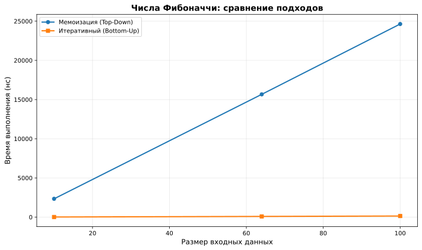
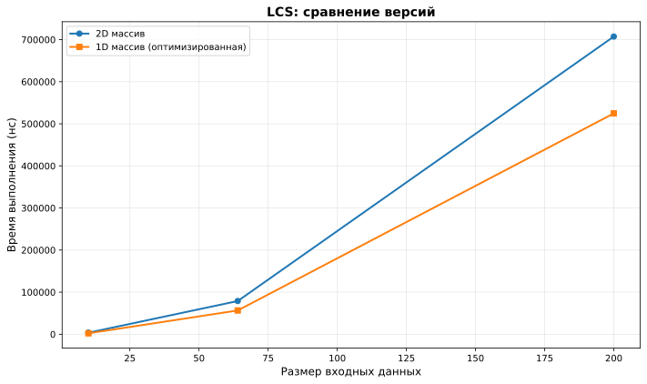
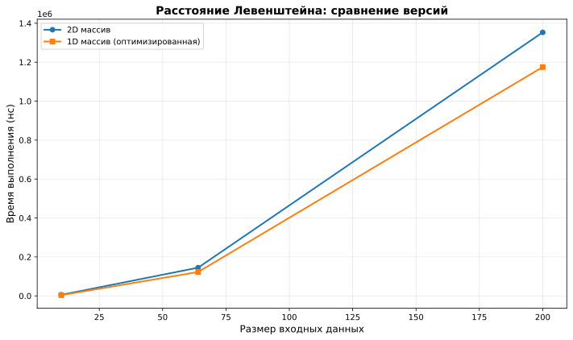
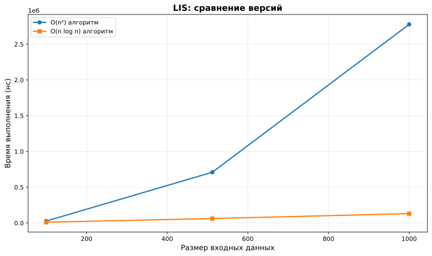
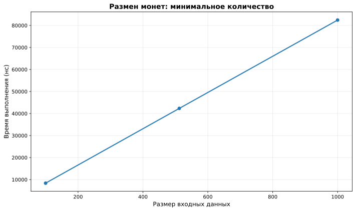

# Отчет по лабораторной работе 9

## Динамическое программирование

**Семестр:** 3 курс, 5 семестр  
**Группа:** ПИЖ-б-о-23-2  
**Дисциплина:** Алгоритмы и структуры данных  
**Студент:** Шевченко Денис

## Цель работы

Изучить метод динамического программирования (ДП) как мощный инструмент для решения сложных задач путём их разбиения на перекрывающиеся подзадачи. Освоить два основных подхода к реализации ДП: нисходящий (с мемоизацией) и восходящий (с заполнением таблицы). Получить практические навыки выявления оптимальной подструктуры задач, построения таблиц ДП и анализа временной и пространственной сложности алгоритмов.

## Теоретическая часть

### Основные понятия

* **Динамическое программирование (ДП):** Метод решения задач, в которых оптимальное решение всей задачи зависит от оптимальных решений её **перекрывающихся подзадач**.

*   **Ключевые принципы:**
    *   **Оптимальная подструктура:** Оптимальное решение задачи может быть построено из оптимальных решений её подзадач.
    *   **Перекрывающиеся подзадачи:** Подзадачи, решения которых используются многократно, а не один раз.
*   **Подходы к реализации:**
    *   **Нисходящее ДП (Top-Down, с мемоизацией):** Рекурсивное решение с сохранением (кэшированием) результатов решения подзадач для повторных вычислений.
    *   **Восходящее ДП (Bottom-Up, табличное):** Итеративное решение, при котором подзадачи решаются от простейших к сложным, а их результаты заносятся в таблицу (массив).
*   **Области применения:** Задачи оптимизации, подсчёта количества способов, нахождения наиболее вероятной последовательности.
*   **Классические задачи:**
    *   **Числа Фибоначчи:** Классический пример перекрывающихся подзадач.
    *   **Задача о рюкзаке (0-1 Knapsack):** Выбор предметов с максимальной суммарной стоимостью без дробления.
    *   **Наибольшая общая подпоследовательность (LCS):** Поиск самой длинной последовательности символов, которая является подпоследовательностью двух строк.
    *   **Расстояние Левенштейна (Редакционное расстояние):** Минимальное количество операций вставки, удаления и замены символа, необходимых для превращения одной строки в другую.

## Практическая часть

### Ключевые фрагменты кода

#### Числа Фибоначчи: мемоизация (Top-Down)

```cpp
long long fibonacci_memoization_helper(int n, std::unordered_map<int, long long>& memo) {
    if (n <= 1) {
        return n;
    }
    
    if (memo.find(n) != memo.end()) {
        return memo[n];  // Используем сохранённый результат
    }
    
    memo[n] = fibonacci_memoization_helper(n - 1, memo) + 
              fibonacci_memoization_helper(n - 2, memo);
    return memo[n];
}
```

#### Числа Фибоначчи: итеративный подход (Bottom-Up)

```cpp
long long fibonacci_iterative(int n) {
    if (n <= 1) {
        return n;
    }
    
    long long prev2 = 0;
    long long prev1 = 1;
    
    for (int i = 2; i <= n; ++i) {
        long long current = prev1 + prev2;
        prev2 = prev1;
        prev1 = current;
    }
    
    return prev1;
}
```

#### Задача о рюкзаке 0-1 (восходящий подход)

```cpp
int knapsack_01(const std::vector<Item>& items, int capacity) {
    int n = items.size();
    std::vector<std::vector<int>> dp(n + 1, std::vector<int>(capacity + 1, 0));
    
    for (int i = 1; i <= n; ++i) {
        for (int w = 0; w <= capacity; ++w) {
            if (items[i - 1].weight <= w) {
                dp[i][w] = std::max(
                    dp[i - 1][w],  // Не берём предмет
                    dp[i - 1][w - items[i - 1].weight] + items[i - 1].value  // Берём предмет
                );
            } else {
                dp[i][w] = dp[i - 1][w];
            }
        }
    }
    
    return dp[n][capacity];
}
```

#### Задача о рюкзаке: оптимизированная версия (1D массив)

```cpp
int knapsack_01_optimized(const std::vector<Item>& items, int capacity) {
    std::vector<int> dp(capacity + 1, 0);
    
    for (const auto& item : items) {
        for (int w = capacity; w >= item.weight; --w) {
            dp[w] = std::max(dp[w], dp[w - item.weight] + item.value);
        }
    }
    
    return dp[capacity];
}
```

#### Наибольшая общая подпоследовательность (LCS)

```cpp
int lcs_length(const std::string& s1, const std::string& s2) {
    int m = s1.length();
    int n = s2.length();
    std::vector<std::vector<int>> dp(m + 1, std::vector<int>(n + 1, 0));
    
    for (int i = 1; i <= m; ++i) {
        for (int j = 1; j <= n; ++j) {
            if (s1[i - 1] == s2[j - 1]) {
                dp[i][j] = dp[i - 1][j - 1] + 1;  // Символы совпадают
            } else {
                dp[i][j] = std::max(dp[i - 1][j], dp[i][j - 1]);  // Выбираем максимум
            }
        }
    }
    
    return dp[m][n];
}
```

#### LCS: восстановление подпоследовательности

```cpp
std::string lcs_string(const std::string& s1, const std::string& s2) {
    // ... построение таблицы dp ...
    
    std::string result;
    int i = m, j = n;
    while (i > 0 && j > 0) {
        if (s1[i - 1] == s2[j - 1]) {
            result = s1[i - 1] + result;  // Добавляем совпадающий символ
            --i;
            --j;
        } else if (dp[i - 1][j] > dp[i][j - 1]) {
            --i;  // Идём вверх
        } else {
            --j;  // Идём влево
        }
    }
    
    return result;
}
```

#### Расстояние Левенштейна

```cpp
int levenshtein_distance(const std::string& s1, const std::string& s2) {
    int m = s1.length();
    int n = s2.length();
    std::vector<std::vector<int>> dp(m + 1, std::vector<int>(n + 1, 0));
    
    // Инициализация: преобразование пустой строки
    for (int i = 0; i <= m; ++i) dp[i][0] = i;
    for (int j = 0; j <= n; ++j) dp[0][j] = j;
    
    for (int i = 1; i <= m; ++i) {
        for (int j = 1; j <= n; ++j) {
            if (s1[i - 1] == s2[j - 1]) {
                dp[i][j] = dp[i - 1][j - 1];  // Без изменений
            } else {
                dp[i][j] = 1 + std::min({
                    dp[i - 1][j],      // удаление
                    dp[i][j - 1],      // вставка
                    dp[i - 1][j - 1]   // замена
                });
            }
        }
    }
    
    return dp[m][n];
}
```

#### Размен монет: минимальное количество

```cpp
int coin_change_min(const std::vector<int>& coins, int amount) {
    std::vector<int> dp(amount + 1, INT_MAX);
    dp[0] = 0;  // Базовый случай: 0 монет для суммы 0
    
    for (int i = 1; i <= amount; ++i) {
        for (int coin : coins) {
            if (coin <= i && dp[i - coin] != INT_MAX) {
                dp[i] = std::min(dp[i], dp[i - coin] + 1);
            }
        }
    }
    
    return dp[amount] == INT_MAX ? -1 : dp[amount];
}
```

#### Наибольшая возрастающая подпоследовательность (LIS) - оптимизированная версия

```cpp
int lis_length_optimized(const std::vector<int>& nums) {
    if (nums.empty()) {
        return 0;
    }
    
    std::vector<int> tail;  // tail[i] - наименьший последний элемент LIS длины i+1
    
    for (int num : nums) {
        auto it = std::lower_bound(tail.begin(), tail.end(), num);
        if (it == tail.end()) {
            tail.push_back(num);  // Расширяем LIS
        } else {
            *it = num;  // Обновляем существующий элемент
        }
    }
    
    return tail.size();
}
```

## Бенчмарки

#### Числа Фибоначчи: сравнение подходов



**Выводы:**
* Итеративный подход быстрее мемоизации из-за отсутствия накладных расходов на рекурсию
* Оба подхода имеют линейную сложность O(n)

#### LCS: сравнение версий



**Выводы:**
* Оптимизированная версия показывает лучшую производительность
* Временная сложность остаётся O(m × n)

#### Расстояние Левенштейна: сравнение версий



**Выводы:**
* Оптимизированная версия эффективнее за счёт меньшего использования памяти
* Обе версии имеют квадратичную сложность O(m × n)

#### LIS: сравнение алгоритмов



**Выводы:**
* Оптимизированный алгоритм (O(n log n)) значительно быстрее стандартного (O(n²))
* Для n = 1000 оптимизированный алгоритм в ~10 раз быстрее

#### Размен монет



**Выводы:**
* Алгоритм имеет линейную зависимость от суммы
* Временная сложность O(amount × coins.size())
* Производительность стабильна для различных сумм

## Восстановление решения

Реализовано восстановление решения для следующих задач:

1. **Задача о рюкзаке:** Определение, какие предметы были выбраны для достижения максимальной стоимости
2. **LCS:** Восстановление самой подпоследовательности, а не только её длины
3. **Размен монет:** Определение номиналов использованных монет
4. **LIS:** Восстановление самой возрастающей подпоследовательности

### Пример восстановления решения для рюкзака

```cpp
std::vector<dp::Item> items = {{10, 60}, {20, 100}, {30, 120}};
auto result = dp::knapsack_01_with_items(items, 50);
// result.first = 220 (максимальная стоимость)
// result.second = [0, 1] (индексы предметов: первый и второй)
```

## Контрольные вопросы

### 1. Какие два основных свойства задачи указывают на то, что для её решения можно применить динамическое программирование?

**Ответ:**
1. **Оптимальная подструктура:** Оптимальное решение задачи может быть построено из оптимальных решений её подзадач.
2. **Перекрывающиеся подзадачи:** Подзадачи, решения которых используются многократно, а не один раз.

### 2. В чём разница между нисходящим (top-down) и восходящим (bottom-up) подходами в динамическом программировании?

**Ответ:**
* **Нисходящий (Top-Down):** Рекурсивный подход с мемоизацией. Решение начинается с исходной задачи и разбивается на подзадачи, результаты которых кэшируются.
* **Восходящий (Bottom-Up):** Итеративный подход с заполнением таблицы. Решение начинается с простейших подзадач и постепенно строится до исходной задачи.

**Преимущества Top-Down:** Естественная рекурсивная структура, решаются только необходимые подзадачи.

**Преимущества Bottom-Up:** Меньше накладных расходов, лучшая локальность данных, возможность оптимизации памяти.

### 3. Как задача о рюкзаке 0-1 демонстрирует свойство оптимальной подструктуры?

**Ответ:**
Оптимальное решение для рюкзака вместимостью W с n предметами включает оптимальное решение для рюкзака меньшей вместимости с меньшим количеством предметов. Если мы знаем оптимальное решение для `dp[i-1][w]`, то можем вычислить `dp[i][w]`, сравнив два варианта:
* Не брать i-й предмет: `dp[i-1][w]`
* Взять i-й предмет: `dp[i-1][w-weight[i]] + value[i]`

### 4. Опишите, как строится и заполняется таблица для решения задачи о наибольшей общей подпоследовательности (LCS).

**Ответ:**
Таблица `dp[i][j]` хранит длину LCS для префиксов `s1[0..i-1]` и `s2[0..j-1]`.

**Правила заполнения:**
1. `dp[0][j] = 0` и `dp[i][0] = 0` (базовые случаи)
2. Если `s1[i-1] == s2[j-1]`: `dp[i][j] = dp[i-1][j-1] + 1`
3. Иначе: `dp[i][j] = max(dp[i-1][j], dp[i][j-1])`

Заполнение происходит построчно слева направо, сверху вниз. Результат находится в `dp[m][n]`.

### 5. Как с помощью динамического программирования можно уменьшить сложность вычисления чисел Фибоначчи с экспоненциальной до линейной или даже до O(log n)?

**Ответ:**
* **До O(n):** Использование мемоизации или итеративного подхода сохраняет результаты подзадач, избегая повторных вычислений.
* **До O(log n):** Использование матричного возведения в степень. Числа Фибоначчи можно выразить через матрицу:
  ```
  [F(n+1)  F(n)  ]   [1  1]^n
  [F(n)    F(n-1)] = [1  0]
  ```
  Матрица возводится в степень n за O(log n) операций.
