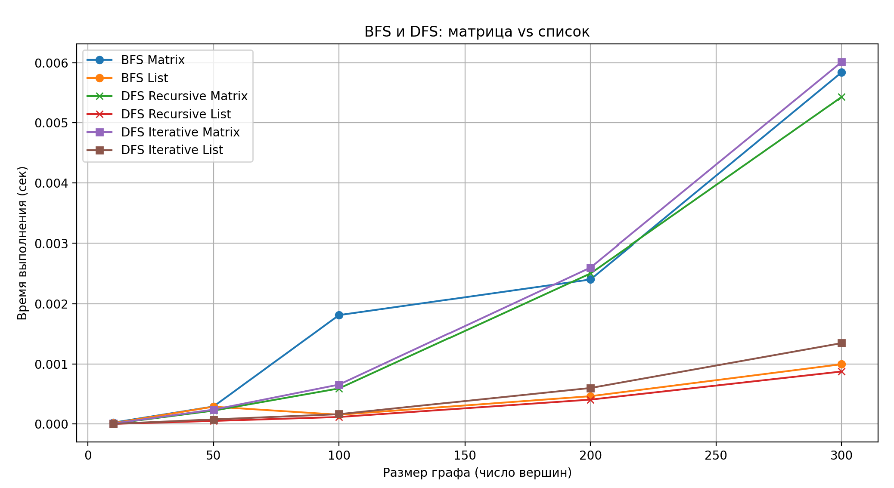
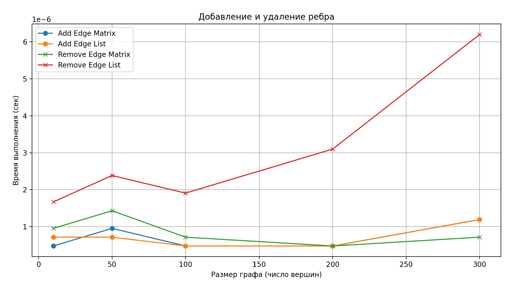
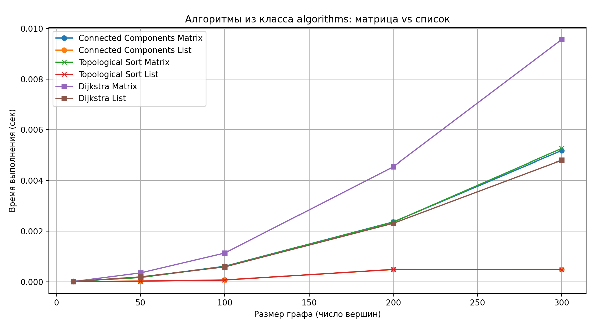

# Отчет по лабораторной работе 10

## Графы

**Семестр:** 3 курс, 5 семестр  
**Группа:** ПИЖ-б-о-23-2  
**Дисциплина:** Алгоритмы и структуры данных  
**Студент:** Шевченко Денис

## Цель работы

Изучить основные понятия теории графов и алгоритмы работы с ними. Освоить представления графов в памяти и основные алгоритмы обхода. Получить практические навыки реализации алгоритмов на графах и анализа их сложности.  

## Теоретическая часть

*   **Граф:** Множество вершин (узлов) и рёбер (связей) между ними. Виды: ориентированные/неориентированные, взвешенные/невзвешенные.
*   **Представление графов:**
    *   Матрица смежности: O(V²) памяти, быстрая проверка ребра
    *   Список смежности: O(V + E) памяти, эффективный обход соседей
*   **Обход графов:**
    *   Поиск в ширину (BFS): находит кратчайшие пути в невзвешенном графе, сложность O(V + E)
    *   Поиск в глубину (DFS): обход с возвратом, сложность O(V + E)
*   **Алгоритмы на графах:**
    *   Топологическая сортировка: для ориентированных ациклических графов (DAG)
    *   Поиск компонент связности
    *   Алгоритм Дейкстры: кратчайшие пути во взвешенном графе с неотрицательными весами

## Практическая часть

### Ключевые фрагменты кода

#### Реализация представлений графов

```python
#Матрица смежности
class AdjacencyMatrixGraph:
    def __init__(self, n):        # O(n^2)
        # количество вершин
        self.n = n
        # матрица смежности n x n
        self.matrix = [[0 for _ in range(n)] for _ in range(n)]

    def add_edge(self, from_v, to_v, weight):   # O(1)
        # добавление направленного ребра from_v -> to_v
        self.matrix[from_v][to_v] = weight

    def remove_edge(self, from_v, to_v):        # O(1)
        # удаление ребра from_v -> to_v
        self.matrix[from_v][to_v] = 0

    def print_matrix(self):     # O(n^2)
        # вспомогательный метод для вывода матрицы
        for row in self.matrix:
            print(row)

#Список смежности
class AdjacencyListGraph:
    def __init__(self, n):        # O(n)
        # количество вершин
        self.n = n
        # список смежности
        self.adj_list = [[] for _ in range(n)]

    def add_edge(self, from_v, to_v, weight):   # O(1)
        # добавление направленного ребра from_v -> to_v
        self.adj_list[from_v].append((to_v, weight))

    def remove_edge(self, from_v, to_v):        # O(k)
        # удаление ребра from_v -> to_v
        # k — количество рёбер из from_v
        new_edges = []
        for (v, w) in self.adj_list[from_v]:
            if v != to_v:
                new_edges.append((v, w))
        self.adj_list[from_v] = new_edges

    def print_list(self):     # O(n + m)
        # вывод списка смежности
        # n — количество вершин, m — общее количество рёбер
        for i in range(self.n):
            print(f"{i} -> {self.adj_list[i]}")

```

#### Поиск в ширину (BFS) c возвратом расстояний и путей

```python
from collections import deque

class BFS:
    def __init__(self, graph, representation):
        """
        graph — матрица смежности или список смежности
        representation — 'matrix' или 'list'
        """
        self.graph = graph
        self.representation = representation
        self.n = len(graph)

    def run(self, start): # O(n + m) для списка, O(n^2) для матрицы
        visited = [False] * self.n
        distance = [-1] * self.n
        parent = [None] * self.n

        queue = deque()
        queue.append(start)
        visited[start] = True
        distance[start] = 0

        while queue:
            v = queue.popleft()

            for u in self._get_neighbors(v):
                if not visited[u]:
                    visited[u] = True
                    distance[u] = distance[v] + 1
                    parent[u] = v
                    queue.append(u)

        paths = self._build_paths(parent, start)
        return distance, paths

    def _get_neighbors(self, v): # O(n) для матрицы, O(deg(v)) для списка
        neighbors = []

        if self.representation == 'matrix':
            for u in range(self.n):
                # вес > 0 значит есть ребро
                if self.graph[v][u] != 0:
                    neighbors.append(u)

        elif self.representation == 'list':
            for u, weight in self.graph[v]:
                neighbors.append(u)

        return neighbors

    def _build_paths(self, parent, start): # O(n^2)
        paths = {}

        for v in range(self.n):
            if v == start:
                paths[v] = [start]
                continue

            path = []
            cur = v
            while cur is not None:
                path.append(cur)
                cur = parent[cur]

            if path[-1] == start:
                paths[v] = path[::-1]
            else:
                paths[v] = None  # пути нет

        return paths

```

#### Поиск в глубину (DFS)

```python
#Итеративный
class IterativeDFS:
    def __init__(self, graph, representation): # O(n)
        self.graph = graph
        self.representation = representation
        self.n = len(graph)
        self.visited = [False] * self.n
        self.order = []

    def run(self, start): # O(n^2) для матрицы, O(n + m) для списка
        stack = [start]

        while stack:
            v = stack.pop()
            if not self.visited[v]:
                self.visited[v] = True
                self.order.append(v)

                # добавляем соседей в стек (обратный порядок, чтобы порядок совпадал с рекурсивным)
                neighbors = self._get_neighbors(v)
                neighbors.reverse()
                for u in neighbors:
                    if not self.visited[u]:
                        stack.append(u)

        return self.order

    def _get_neighbors(self, v):  # O(n) для матрицы, O(deg(v)) для списка
        neighbors = []
        if self.representation == 'matrix':
            for u in range(self.n):
                if self.graph[v][u] != 0:
                    neighbors.append(u)
        elif self.representation == 'list':
            for u, weight in self.graph[v]:
                neighbors.append(u)
        return neighbors


#Рекурсивный
class RecursiveDFS:
    def __init__(self, graph, representation): # O(n)
        """
        graph — матрица смежности или список смежности
        representation — 'matrix' или 'list'
        """
        self.graph = graph
        self.representation = representation
        self.n = len(graph)
        self.visited = [False] * self.n
        self.order = []  # порядок обхода вершин

    def run(self, start): # O(n^2) для матрицы, O(n + m) для списка
        self._dfs(start)
        return self.order

    def _dfs(self, v): # O(n^2) для матрицы, O(n + m) для списка
        self.visited[v] = True
        self.order.append(v)

        for u in self._get_neighbors(v):
            if not self.visited[u]:
                self._dfs(u)

    def _get_neighbors(self, v): # O(n) для матрицы, O(deg(v)) для списка
        neighbors = []
        if self.representation == 'matrix':
            for u in range(self.n):
                if self.graph[v][u] != 0:
                    neighbors.append(u)
        elif self.representation == 'list':
            for u, weight in self.graph[v]:
                neighbors.append(u)
        return neighbors

```

#### Реализация алгоритмов

```python
    # --- для списка смежности ---
    #Поиск компонент связности 
    def find_connected_components(graph: AdjacencyListGraph):  # O(n + m)
        n = graph.n
        visited = [False] * n
        components = []

        def dfs_collect(v, component):
            visited[v] = True
            component.append(v)
            for neighbor, _ in graph.adj_list[v]:
                if not visited[neighbor]:
                    dfs_collect(neighbor, component)

        for v in range(n):
            if not visited[v]:
                component = []
                dfs_collect(v, component)
                components.append(component)
        return components

    #Топологическая сортировка
    def topological_sort(graph: AdjacencyListGraph):  # O(n + m)
        visited = [False] * graph.n
        result = []

        def dfs(v):
            visited[v] = True
            for neighbor, _ in graph.adj_list[v]:
                if not visited[neighbor]:
                    dfs(neighbor)
            result.append(v)

        for v in range(graph.n):
            if not visited[v]:
                dfs(v)

        result.reverse()
        return result

    #Алгоритм Дейкстры
    def dijkstra(graph: AdjacencyListGraph, start):  # O(n^2)
        n = graph.n
        visited = [False] * n
        dist = [float('inf')] * n
        dist[start] = 0

        for _ in range(n):
            u = -1
            min_dist = float('inf')
            for i in range(n):
                if not visited[i] and dist[i] < min_dist:
                    min_dist = dist[i]
                    u = i

            if u == -1:
                break

            visited[u] = True

            for v, w in graph.adj_list[u]:
                if dist[u] + w < dist[v]:
                    dist[v] = dist[u] + w

        return dist

    # --- для матрицы смежности ---
    #Поиск компонент связности
    def find_connected_components_matrix(graph: AdjacencyMatrixGraph):  # O(n^2)
        n = graph.n
        visited = [False] * n
        components = []

        def dfs_collect(v, component):
            visited[v] = True
            component.append(v)
            for u in range(n):
                if graph.matrix[v][u] != 0 and not visited[u]:
                    dfs_collect(u, component)

        for v in range(n):
            if not visited[v]:
                component = []
                dfs_collect(v, component)
                components.append(component)
        return components

    #Топологическая сортировка
    def topological_sort_matrix(graph: AdjacencyMatrixGraph):  # O(n^2)
        n = graph.n
        visited = [False] * n
        result = []

        def dfs(v):
            visited[v] = True
            for u in range(n):
                if graph.matrix[v][u] != 0 and not visited[u]:
                    dfs(u)
            result.append(v)

        for v in range(n):
            if not visited[v]:
                dfs(v)

        result.reverse()
        return result

    #Алгоритм Дейкстры
    def dijkstra_matrix(graph: AdjacencyMatrixGraph, start):  # O(n^2)
        n = graph.n
        visited = [False] * n
        dist = [float('inf')] * n
        dist[start] = 0

        for _ in range(n):
            u = -1
            min_dist = float('inf')
            for i in range(n):
                if not visited[i] and dist[i] < min_dist:
                    min_dist = dist[i]
                    u = i

            if u == -1:
                break

            visited[u] = True

            for v in range(n):
                if graph.matrix[u][v] != 0:
                    if dist[u] + graph.matrix[u][v] < dist[v]:
                        dist[v] = dist[u] + graph.matrix[u][v]

        return dist
```


## Бенчмарки

#### Скорость BFS и DFS на разных представлениях графов



**Выводы:**
* BFS и два варианта реализации DFS демонстрируют приблизительное равные результаты в скорости работы в рамках работы с одним и тем же представлением графа.    
* BFS и DFS заметно быстрее выполняется при представлении графа списком смежности.  

#### Добавление и удаление рёбер



**Выводы:**
* Добавление рёбер занимает одинаковое время как для матрицы, так и для списка смежности.  
* Удалёние рёбер происходит быстрее для матрицы смежности.  

#### Масштабирование алгоритмов поиска связнности, Дейкстры, топологической сортировки  



**Выводы:**
* Матричное представление справляется хуже представления списком с поставленными алгоритмами.  

## **Контрольные вопросы:**  
1.  В чем разница между представлением графа в виде матрицы смежности и списка смежности? Сравните их по потреблению памяти и сложности операций.  
**Ответ:** Матрица смежности хранит все возможные связи в виде квадратной матрицы, требует много памяти, но проверка ребра мгновенная. Список смежности хранит только существующие связи, экономит память и быстрее обходить соседей в разреженных графах.  
2.  Опишите алгоритм поиска в ширину (BFS). Для решения каких задач он применяется?  
**Ответ:** BFS обходит граф по уровням, начиная с выбранной вершины, используя очередь. Применяется для поиска кратчайшего пути в невзвешенном графе и проверки связности.
3.  Чем поиск в глубину (DFS) отличается от BFS? Какие дополнительные задачи (например, проверка на ацикличность) можно решить с помощью DFS?  
**Ответ:** DFS идёт по одной ветке до конца, используя рекурсию или стек, в отличие от BFS. С его помощью проверяют ацикличность, находят компоненты связности и выполняют топологическую сортировку.
4.  Как алгоритм Дейкстры находит кратчайшие пути во взвешенном графе? Почему он не работает с отрицательными весами ребер?  
**Ответ:** Дейкстра находит кратчайшие пути, выбирая вершину с минимальным расстоянием и обновляя соседей. Не работает с отрицательными ребрами, так как расстояние может уменьшиться после обработки.
5.  Что такое топологическая сортировка и для каких графов она применима? Приведите пример задачи, где она используется.  
**Ответ:** Топологическая сортировка упорядочивает вершины ориентированного ациклического графа так, чтобы каждая вершина шла перед зависимыми от неё. Используется для планирования задач с зависимостями.